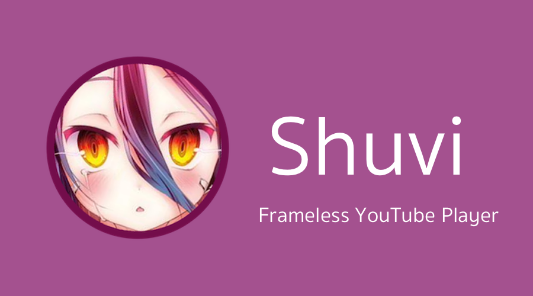
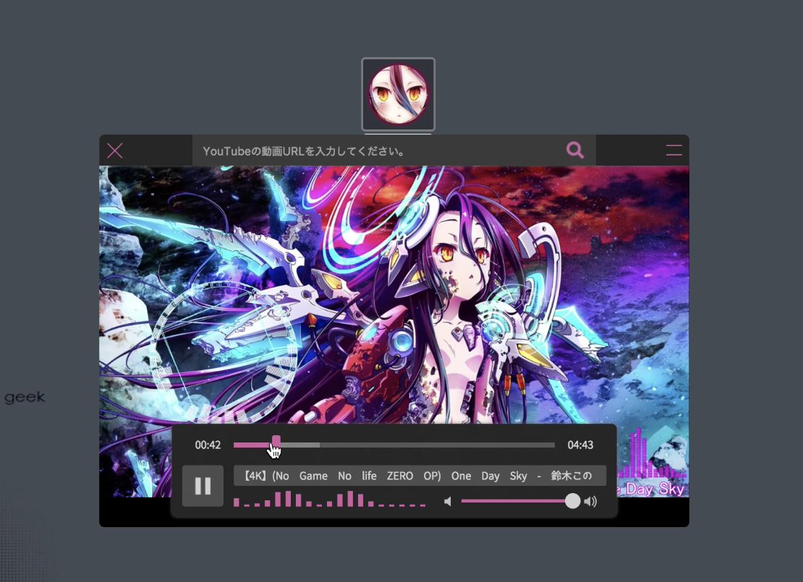
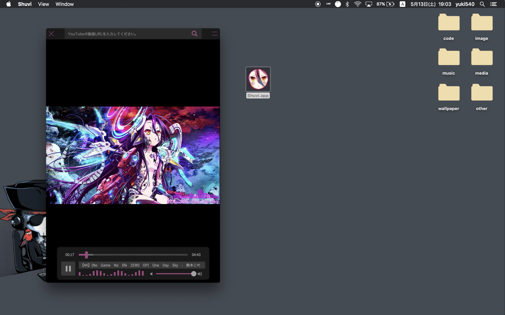
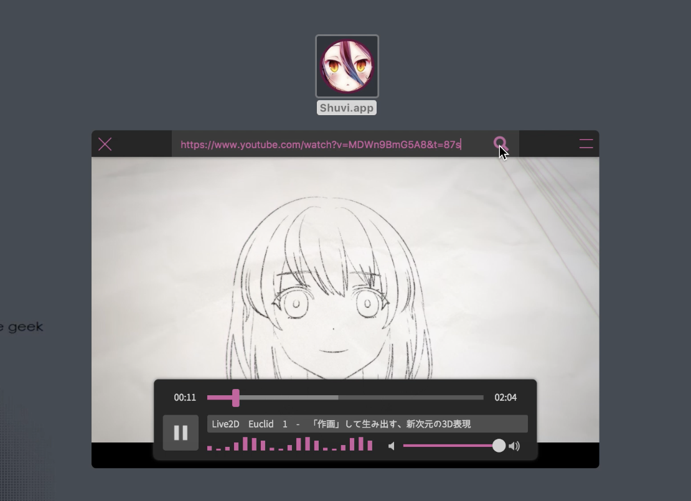
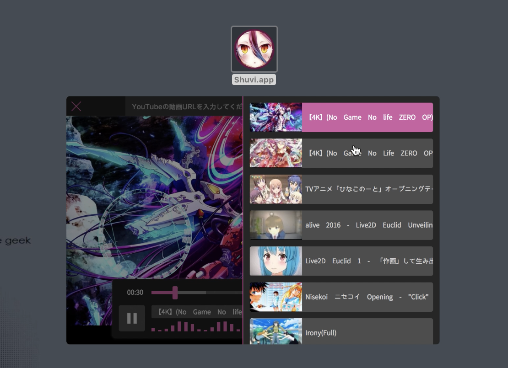

# Shuvi - シュヴィ

슈비는 Electron으로 만들어진 frameless YouTube 플레이어입니다.

- About Shuvi
  - [Qiita - ElectronでフレームレスなYouTubeプレイヤーを作ってみた](http://qiita.com/yuki540/items/af0f909b2256a9c80e6c)
- Download Shuvi
  - [GitHub - Releases](https://github.com/yuki540net/Shuvi/releases/tag/v0.0.1)
- 개발자
   - yui540
   - [Twitter - @yui540](https://twitter.com/yui540)
   - [HP - magical-girl.site](https://magical-girl.site/)

## 단순함이란 궁극의 정교함이다. ---- Leonardo da Vinci
Shuvi의 특징은 단순한 디자인입니다.

프레임 없는 윈도우는 Mac의 QuickTime의 UI와 비슷합니다.

Shuvi는 크기나 모양에 대하여 제한되지 않습니다.

언제나 크기나 모양을 바꾸는 것이 가능합니다.

영상을 재생하는 방법은, YouTube URL을 복사하고 붙여 넣으면 간단하게 동작합니다.

최근에 보았던 영상을 재상하는 방법할때는, 다시 붙여넣기를 할 필요가 없습니다.

### ---- Shuivi와 함께 편안한 동영상 생활을 즐기세요! .

## Lisense

이 소프트웨어틑 MIT 라이센스를 준수합니다.
